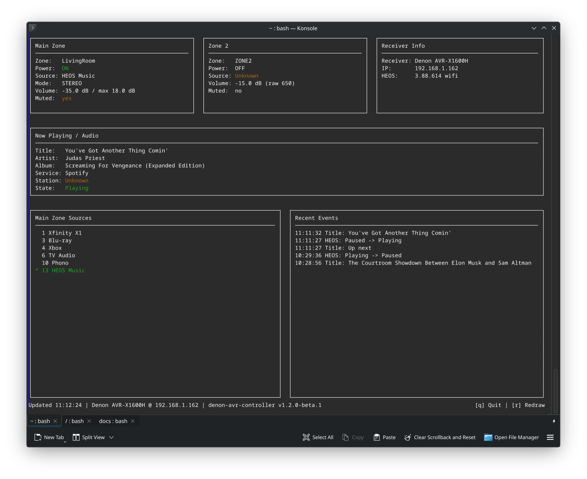
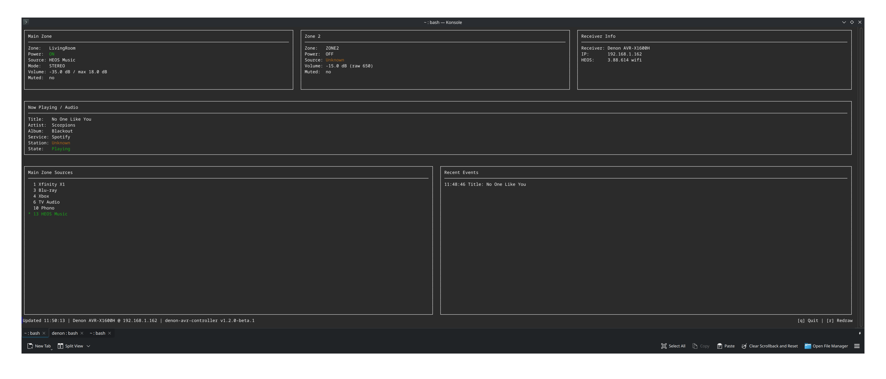
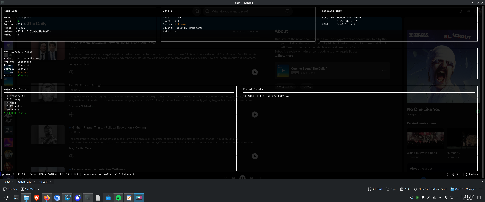

# Denon AVR Controller

A practical CLI/dashboard tool for controlling and inspecting Denon AVR receivers and HEOS playback over the local network.

## Current Status

Current version: `v1.2.0-beta.1`.

The project currently supports a Bash shell CLI, a terminal dashboard, safe receiver diagnostics/data inventory commands, HEOS playback metadata/control where the receiver exposes it, and a native PowerShell module. It is a local-network receiver control and diagnostics tool; it does not use a cloud service.

The Bash CLI has the widest feature coverage. The PowerShell module covers common read-only status, source, volume, mute, Zone 2, dashboard, and basic control workflows, but it does not yet cover every Bash CLI data discovery or HEOS workflow.

## Features

- Receiver status and receiver info output, including JSON modes.
- Main Zone power, source, volume, mute, sound mode, sleep, Quick Select, and media controls.
- Zone 2 status, source, power, mute, volume, and sleep controls where supported by the receiver.
- HEOS and Spotify now-playing metadata through receiver/HEOS read-only surfaces.
- HEOS playback, queue, group, browse/search, play-stream, repeat, shuffle, and update commands in the Bash CLI.
- Terminal dashboard with one-shot and watch modes, ASCII/Unicode rendering, color controls, source lists, now-playing details, receiver info, and recent events.
- Source list display plus local source display aliases.
- Receiver diagnostics through `doctor`, `signal-debug`, `data summary`, and `data fields`.
- Safe read-only data dump and discovery commands for supported HTTP/XML, AppCommand, Deviceinfo, telnet query, HEOS, and web UI surfaces.
- Snapshot and diff commands for comparing receiver XML state captures.
- Native PowerShell module support for PowerShell 7+ and Windows PowerShell 5.1 core workflows.

## Screenshots







## Requirements

- Local network access to a compatible Denon AVR.
- Bash CLI: `bash`, `curl`, `awk`, `sed`, `grep`, `tr`, `mktemp`; `ip`, `arp`, `nc`, and `zsh` are useful for discovery, telnet queries, and shell-loading checks.
- HEOS helper workflows: `python3`.
- Tests: `pytest`.
- PowerShell module: `pwsh` / PowerShell 7+ preferred; Windows PowerShell 5.1 should work for core module commands.
- Optional development checks: `shellcheck`, `Pester`, `PSScriptAnalyzer`.

## Installation

Clone the repository and make the scripts executable:

```bash
git clone https://github.com/tiffany98101/denon-avr-controller.git
cd denon-avr-controller
chmod +x denon_release_candidate.sh denon_automated_test.sh denon_heos_helper.py
```

For local development in this workspace, the active repository path is:

```text
/home/administrator/organized_projects/denon/denon_main
```

Run the script directly:

```bash
./denon_release_candidate.sh doctor
./denon_release_candidate.sh status
```

Optional per-user wrapper install:

```bash
mkdir -p "$HOME/.local/lib/denon" "$HOME/.local/bin"
cp -a . "$HOME/.local/lib/denon/"
cat >"$HOME/.local/bin/denon" <<'EOF'
#!/usr/bin/env bash
source "$HOME/.local/lib/denon/denon_release_candidate.sh"
denon "$@"
EOF
chmod +x "$HOME/.local/bin/denon"
```

Make sure `$HOME/.local/bin` is on `PATH`, then use `denon status` instead of
`./denon_release_candidate.sh status`.

Optional system-wide wrapper install:

```bash
sudo mkdir -p /usr/local/lib/denon
sudo cp -a . /usr/local/lib/denon/
sudo tee /usr/local/bin/denon >/dev/null <<'EOF'
#!/usr/bin/env bash
source /usr/local/lib/denon/denon_release_candidate.sh
denon "$@"
EOF
sudo chmod +x /usr/local/bin/denon
```

If both `$HOME/.local/bin/denon` and `/usr/local/bin/denon` exist, the one that
appears first in `PATH` wins. On many systems, `$HOME/.local/bin` shadows
`/usr/local/bin`, so an older per-user wrapper can keep running an older checkout
even after the system-wide wrapper is updated.

Check the active wrapper:

```bash
type -a denon
command -v denon
sed -n '1,20p' "$(command -v denon)"
hash -r
denon --version
```

If `type -a denon` shows a stale wrapper first, update that wrapper to point at
the intended checkout or remove it:

```bash
rm "$HOME/.local/bin/denon"
hash -r
```

## Configuration

The receiver must be reachable on the same local network as the machine running
the tool. Most commands use the Bash CLI's normal receiver lookup order:

1. `DENON_IP`: explicit receiver IP for the current command/session.
2. Cached IP from `denon setip <ip>` or a previous successful discovery.
3. `DENON_DEFAULT_IP`: fallback IP.
4. SSDP and known local hosts.
5. LAN scanning when `DENON_SCAN_LAN=1` is set.

Recommended setup:

```bash
export DENON_IP=192.168.1.162
./denon_release_candidate.sh doctor
./denon_release_candidate.sh status
```

To store a local cached IP instead:

```bash
./denon_release_candidate.sh setip 192.168.1.162
./denon_release_candidate.sh status
```

`denon discover` clears the cached IP and attempts discovery again. Live `data`
modes do not run a network scan; they require `DENON_IP`, `DENON_DEFAULT_IP`, or
a cached IP.

Common configuration variables:

```bash
DENON_IP=192.168.1.162
DENON_DEFAULT_IP=192.168.1.162
DENON_SCAN_LAN=1
DENON_MAX_VOLUME_DB=-10
DENON_VOLUME_STEP_DB=1
DENON_SOURCE_ALIASES='13=HEOS Music,6=TV Audio'
DENON_HEOS_PID=...
DENON_HEOS_GID=...
DENON_DATA_DISCOVERY_MAX_TYPE=30
```

The PowerShell module keeps receiver configuration in memory for the current PowerShell session. It also checks `DENON_IP` and then `DENON_DEFAULT_IP` as fallbacks.

## Usage Examples

Read-only status and dashboard:

```bash
./denon_release_candidate.sh status
./denon_release_candidate.sh status --json
./denon_release_candidate.sh info
./denon_release_candidate.sh info --json
./denon_release_candidate.sh dashboard --unicode
./denon_release_candidate.sh dashboard --color always --unicode --interval 5
./denon_release_candidate.sh dashboard --diagnostics --watch --interval 5 --color always --unicode
```

Data inventory and diagnostics:

```bash
./denon_release_candidate.sh data fields --all
./denon_release_candidate.sh data fields --available
./denon_release_candidate.sh data summary
./denon_release_candidate.sh data summary --json
./denon_release_candidate.sh data dump --readable
./denon_release_candidate.sh data dump --json
./denon_release_candidate.sh data dump --raw
./denon_release_candidate.sh data capabilities --json
./denon_release_candidate.sh data discover --json
```

Main Zone controls:

```bash
./denon_release_candidate.sh on
./denon_release_candidate.sh off
./denon_release_candidate.sh vol
./denon_release_candidate.sh vol -35
./denon_release_candidate.sh up 1
./denon_release_candidate.sh down 1
./denon_release_candidate.sh mute
./denon_release_candidate.sh unmute
./denon_release_candidate.sh sources
./denon_release_candidate.sh source heos
./denon_release_candidate.sh source tv
```

Zone 2 controls:

```bash
./denon_release_candidate.sh zone2 status
./denon_release_candidate.sh zone2 sources
./denon_release_candidate.sh zone2 on
./denon_release_candidate.sh zone2 source 10
./denon_release_candidate.sh zone2 mute
./denon_release_candidate.sh zone2 unmute
./denon_release_candidate.sh zone2 volume 650
./denon_release_candidate.sh zone2 sleep 60
```

HEOS examples:

```bash
./denon_release_candidate.sh heos now
./denon_release_candidate.sh heos play
./denon_release_candidate.sh heos pause
./denon_release_candidate.sh heos queue
./denon_release_candidate.sh heos groups
./denon_release_candidate.sh heos browse sources
./denon_release_candidate.sh heos search spotify "scorpions"
```

Raw and snapshot workflows:

```bash
./denon_release_candidate.sh rawstatus
./denon_release_candidate.sh raw get 3
./denon_release_candidate.sh raw get 7
./denon_release_candidate.sh snapshot
./denon_release_candidate.sh diff snapshots/a snapshots/b
```

Run `./denon_release_candidate.sh --help` for the full command list.

## PowerShell Module

Module path:

```text
powershell/DenonAvrController/DenonAvrController.psd1
```

Import the module from the repository root:

```powershell
Import-Module ./powershell/DenonAvrController/DenonAvrController.psd1 -Force
Get-Command -Module DenonAvrController
```

Configure the receiver for the current PowerShell session:

```powershell
Set-DenonReceiver -IpAddress 192.168.1.162
```

If the receiver's HTTPS certificate is not trusted:

```powershell
Set-DenonReceiver -IpAddress 192.168.1.162 -SkipCertificateCheck
```

Read-only examples:

```powershell
Test-DenonReceiver
Get-DenonInfo
Get-DenonStatus
Get-DenonReceiverSummary
Get-DenonNowPlaying
Get-DenonSources
Get-DenonZone2Status
Get-DenonSleep
Show-DenonDashboard
```

Control examples:

```powershell
Set-DenonPower -On
Set-DenonMute -Off
Set-DenonVolume -Db -42
Step-DenonVolume -Db -1
Set-DenonSource -Name "HEOS Music"
Set-DenonZone2Power -Off
```

Validate the module:

```powershell
Test-ModuleManifest ./powershell/DenonAvrController/DenonAvrController.psd1
Import-Module ./powershell/DenonAvrController/DenonAvrController.psd1 -Force
Get-Command -Module DenonAvrController
```

Run module tests if Pester is installed:

```powershell
Invoke-Pester ./powershell/DenonAvrController/DenonAvrController.Tests.ps1
```

Run ScriptAnalyzer if installed:

```powershell
Invoke-ScriptAnalyzer -Path ./powershell/DenonAvrController -Recurse
```

See [powershell/DenonAvrController/README.md](powershell/DenonAvrController/README.md) for detailed module behavior and limitations.

## Testing

Baseline shell checks:

```bash
bash -n denon_release_candidate.sh
pytest -q
```

PowerShell validation:

```powershell
$PSVersionTable
Get-ChildItem -Recurse -Include *.psd1 | ForEach-Object {
  Test-ModuleManifest $_.FullName | Select-Object Name,Version,RootModule,ExportedFunctions
}
Get-ChildItem -Recurse -Include *.psm1 | ForEach-Object {
  Import-Module $_.FullName -Force
}
```

The repository also includes `denon_automated_test.sh` for live receiver checks:

```bash
./denon_automated_test.sh --script ./denon_release_candidate.sh
```

Only run destructive/state-changing live checks when the receiver is available for testing:

```bash
./denon_automated_test.sh --script ./denon_release_candidate.sh --destructive
```

## GitHub Readiness

- Documentation and screenshots use relative paths.
- Generated caches, logs, local receiver dumps, virtual environments, and editor backup files are ignored.
- `docs/` screenshots and reference documentation are intended to stay tracked.
- Do not commit local receiver dumps that may contain serial numbers, MAC addresses, network identifiers, account state, or other receiver-provided private data.
- Do not push generated test/cache output.

## Known Limitations

- Denon receiver models and firmware vary; not every field or command is available on every AVR.
- Some firmware fields are not exposed by the tested read-only Denon HTTP/XML, AppCommand, Deviceinfo, telnet, UPnP, or HEOS surfaces.
- HEOS/AIOS firmware is separate from AVR mainboard firmware.
- Commands require local network access to the receiver.
- Some control commands change receiver state immediately; start with read-only commands when validating a new receiver.
- The PowerShell module does not yet cover every Bash CLI feature, especially full HEOS browse/search/queue workflows, full data discovery, capability inventory, snapshots, and diffing.

## Development Notes

This project was developed with AI assistance and then reviewed, tested, and refined by the maintainer on real Denon AVR hardware. Final behavior, validation, and publishing decisions belong to the maintainer.
