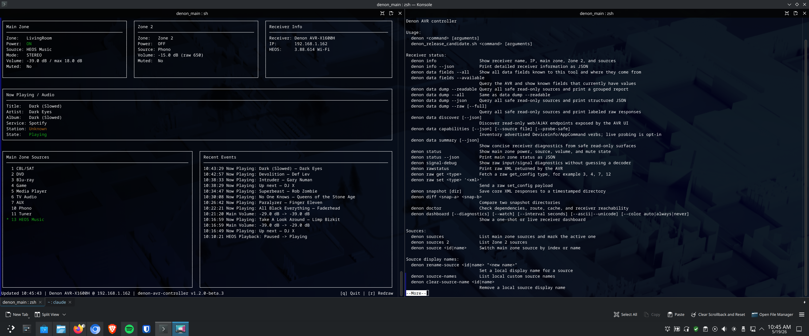
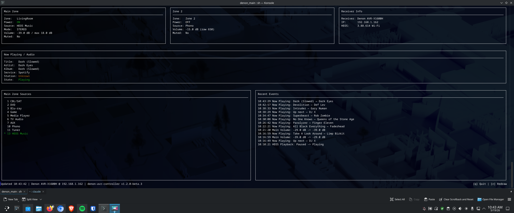

# Denon AVR Controller

A practical CLI/dashboard tool for controlling and inspecting Denon AVR receivers and HEOS playback over the local network.

## Current Status

Current version: `v1.2.0-beta.5`.

The project currently supports a Bash shell CLI, a terminal dashboard, safe receiver diagnostics/data inventory commands, HEOS playback metadata/control where the receiver exposes it, and a native PowerShell module. It is a local-network receiver control and diagnostics tool; it does not use a cloud service.

The Bash CLI remains the source-of-truth implementation. The PowerShell module now exposes the same user-facing command surface where practical with native PowerShell functions, a Bash-style `Invoke-DenonCommand` migration shim, shared config/cache behavior, HEOS helper integration, data/raw/snapshot/profile/preset helpers, and PowerShell argument-completion metadata.

## Features

- Receiver status and receiver info output, including JSON modes.
- Main Zone power, source, volume, mute, sound mode, sleep, Quick Select, and media controls.
- Zone 2 status, source, power, mute, volume, and sleep controls where supported by the receiver.
- HEOS and Spotify now-playing metadata through receiver/HEOS read-only surfaces.
- HEOS playback, queue, group, browse/search, play-stream, repeat, shuffle, and update commands in the Bash CLI.
- Terminal dashboard with one-shot and watch modes, ASCII/Unicode rendering, color controls, source lists, now-playing details, receiver info, and recent events.
- Source list display plus local source display aliases.
- Receiver diagnostics through `doctor`, `signal-debug`, `data summary`, and `data fields`.
- Safe read-only data dump and discovery commands for supported HTTP/XML, AppCommand, Deviceinfo, telnet query, HEOS, and web UI surfaces.
- Snapshot and diff commands for comparing receiver XML state captures.
- Native PowerShell module support for PowerShell 7+ on Linux, macOS, and Windows.

## Screenshots





## Requirements

- Local network access to a compatible Denon AVR.
- Bash CLI runtime: `bash`, `curl`, `awk`, `sed`, `grep`, `tr`, `mktemp`; `ip`, `arp`, and `nc` are useful for discovery and telnet queries; `avahi-tools` (`avahi-browse`) enables fast mDNS discovery on Fedora (`sudo dnf install avahi-tools`).
- Shell completions are available for bash, zsh, and fish. Completion support does not mean `denon.sh` is sourced or executed as zsh/fish; the runtime script requires bash.
- HEOS helper workflows: `python3`.
- Tests: `pytest`.
- PowerShell module: `pwsh` / PowerShell 7+.
- Optional development checks: `shellcheck`, `Pester`, `PSScriptAnalyzer`.

## Installation

Clone the repository and make the scripts executable:

```bash
git clone https://github.com/tiffany98101/denon-avr-controller.git
cd denon-avr-controller
chmod +x denon.sh denon_automated_test.sh denon_heos_helper.py
```

For local development, run commands from the repository root:

```text
denon-avr-controller/
```

Run the script directly:

```bash
./denon.sh doctor
./denon.sh status
```

Optional per-user wrapper install:

```bash
mkdir -p "$HOME/.local/lib/denon" "$HOME/.local/bin"
cp -a . "$HOME/.local/lib/denon/"
cat >"$HOME/.local/bin/denon" <<'EOF'
#!/usr/bin/env bash
source "$HOME/.local/lib/denon/denon.sh"
denon "$@"
EOF
chmod +x "$HOME/.local/bin/denon"
```

Make sure `$HOME/.local/bin` is on `PATH`, then use `denon status` instead of
`./denon.sh status`.

Optional system-wide wrapper install:

```bash
sudo mkdir -p /usr/local/lib/denon
sudo cp -a . /usr/local/lib/denon/
sudo tee /usr/local/bin/denon >/dev/null <<'EOF'
#!/usr/bin/env bash
source /usr/local/lib/denon/denon.sh
denon "$@"
EOF
sudo chmod +x /usr/local/bin/denon
```

If both `$HOME/.local/bin/denon` and `/usr/local/bin/denon` exist, the one that
appears first in `PATH` wins. On many systems, `$HOME/.local/bin` shadows
`/usr/local/bin`, so an older per-user wrapper can keep running an older checkout
even after the system-wide wrapper is updated.

Check the active wrapper:

```bash
type -a denon
command -v denon
sed -n '1,20p' "$(command -v denon)"
hash -r
denon --version
```

If `type -a denon` shows a stale wrapper first, update that wrapper to point at
the intended checkout or remove it:

```bash
rm "$HOME/.local/bin/denon"
hash -r
```

### Shell Completions

RPM/package installs still place completion files in the normal system
locations for bash, zsh, and fish. For a per-user install from a checkout or
wrapper, use:

```bash
denon completion install
denon completion install --shell bash
```

The installer writes to the standard user-level completion path for the selected
shell, creates directories as needed, and will not overwrite a different file
unless you pass `--force`. Restart your shell after installing, or reload the
completion file according to your shell. These completion files support zsh and
fish users at the interactive shell level; `denon.sh` itself is still a bash
runtime script and should be run directly or through the installed `denon`
wrapper.

To install manually, print a completion script and redirect it:

```bash
mkdir -p ~/.local/share/bash-completion/completions
denon completion bash > ~/.local/share/bash-completion/completions/denon
```

### Optional KDE/Fedora Tray Launcher

The CLI can be launched from a small optional system tray helper. This does not
change normal CLI behavior and installs only per-user files.

Install it:

```bash
scripts/install-tray-launcher.sh
```

Start it:

```bash
~/.local/bin/denon-tray-launcher
```

Enable desktop-session autostart:

```bash
scripts/install-tray-launcher.sh --autostart
```

Uninstall files created by the installer:

```bash
scripts/install-tray-launcher.sh --uninstall
```

The tray menu can open the dashboard, restart the dashboard terminal, or quit the
tray helper. On Fedora KDE, install dependencies if needed:

```bash
sudo dnf install konsole python3-qt6
sudo dnf install python3-qt5    # fallback if PyQt6 is unavailable
```

## Configuration

The receiver must be reachable on the same local network as the machine running
the tool. Most commands use the Bash CLI's normal receiver lookup order:

1. `DENON_IP`: explicit receiver IP for the current command/session.
2. Cached IP from `denon setip <ip>` or a previous successful discovery.
3. `DENON_DEFAULT_IP`: fallback IP.
4. Avahi/mDNS (`avahi-browse`): probes `_heos-audio._tcp` then `_airplay._tcp`, sub-second on a local network.
5. SSDP and known local hosts.
6. LAN scanning when `DENON_SCAN_LAN=1` is set.

Recommended setup:

```bash
export DENON_IP=192.0.2.10
./denon.sh doctor
./denon.sh status
```

To store a local cached IP instead:

```bash
./denon.sh setip 192.0.2.10
./denon.sh status
```

`denon discover` clears the cached IP and attempts discovery again. Live `data`
modes do not run a network scan; they require `DENON_IP`, `DENON_DEFAULT_IP`, or
a cached IP.

Common configuration variables:

```bash
DENON_IP=192.0.2.10
DENON_DEFAULT_IP=192.0.2.10
DENON_SCAN_LAN=1
DENON_MAX_VOLUME_DB=-10
DENON_VOLUME_STEP_DB=1
DENON_SOURCE_ALIASES='13=HEOS Music,6=TV Audio'
DENON_CURL_INSECURE=1
DENON_CURL_CACERT="$HOME/.config/denon/avr-cert.pem"
DENON_CURL_PINNEDPUBKEY='sha256//...'
DENON_HEOS_PID=...
DENON_HEOS_GID=...
DENON_DATA_DISCOVERY_MAX_TYPE=30
```

The PowerShell module reads the same `DENON_CONFIG` key/value file format and honors environment overrides. Its receiver lookup order is `Set-DenonReceiver` session state, `DENON_IP`, cached receiver IP, and `DENON_DEFAULT_IP`; `Find-DenonReceiver -RefreshCache` also attempts SSDP discovery.

### HTTPS/TLS Verification

Many Denon/Marantz AVR web interfaces use self-signed or locally untrusted HTTPS certificates. For compatibility, the Bash CLI defaults to curl's insecure certificate mode (`-k`). That works on typical trusted home LANs, but it does not protect against a local network MITM.

You can opt into stricter behavior:

```bash
DENON_CURL_INSECURE=0 denon status
DENON_CURL_CACERT="$HOME/.config/denon/avr-cert.pem" denon status
DENON_CURL_PINNEDPUBKEY='sha256//...' denon status
```

`DENON_CURL_CACERT` passes a custom CA/certificate bundle to curl. `DENON_CURL_PINNEDPUBKEY` passes curl's pinned public key value, such as `sha256//BASE64HASH` or a local key file path. `denon doctor` reports the active TLS mode.

## Usage Examples

Read-only status and dashboard:

```bash
./denon.sh status
./denon.sh status --json
./denon.sh info
./denon.sh info --json
./denon.sh dashboard --unicode
./denon.sh dashboard --color always --unicode --interval 5
./denon.sh dashboard --diagnostics --watch --interval 5 --color always --unicode
```

Experimental alternative dashboard:

The existing shell dashboard remains the default. `dashboard-alt` starts a new
Python-based preview path that separates snapshot collection from rendering so it
can evolve without rewriting the current dashboard. Its default `--provider auto`
mode tries direct Python receiver reads first and falls back to the shell
provider if direct collection cannot start. `--compare-providers` prints a
one-shot diagnostic comparison between direct and shell snapshots. `--json`
prints one serialized snapshot and cannot be combined with `--watch` or
`--compare-providers`.

The renderer uses a two-column panel layout on wide terminals, a simpler stacked
layout on medium widths, and a compact stacked layout on narrow terminals. Use
`--unicode` for box drawing, `--ascii` for plain borders, and
`--color auto|always|never` to control ANSI color. For repeatable manual checks,
set `DENON_DASHBOARD_WIDTH` and `DENON_DASHBOARD_HEIGHT`.

When `dashboard-alt --watch` is running in an interactive terminal, it accepts
single-key controls without Enter: Up/Down adjust volume, Left/Right send
previous/next, Space toggles play/pause, `m` toggles mute, `1`-`4` recall Quick
Select 1-4, `z` cycles the volume/mute control target between Main and Zone2,
and `q` quits the dashboard. Transport keys keep using the active HEOS/player
path. These keys are disabled for non-TTY input and are not used by the legacy
Bash dashboard.

```bash
denon dashboard-alt --provider auto
denon dashboard-alt --provider direct --json
denon dashboard-alt --compare-providers
denon dashboard-alt --watch --interval 2
DENON_DASHBOARD_WIDTH=120 DENON_DASHBOARD_HEIGHT=40 denon dashboard-alt --provider auto --color always --unicode
DENON_DASHBOARD_WIDTH=50 DENON_DASHBOARD_HEIGHT=20 denon dashboard-alt --provider auto --ascii --color never
```

Data inventory and diagnostics:

```bash
./denon.sh data fields --all
./denon.sh data fields --available
./denon.sh data summary
./denon.sh data summary --json
./denon.sh data dump --readable
./denon.sh data dump --json
./denon.sh data dump --raw
./denon.sh data capabilities --json
./denon.sh data discover --json
```

Main Zone controls:

```bash
./denon.sh on
./denon.sh off
./denon.sh vol
./denon.sh vol -35
./denon.sh up 1
./denon.sh down 1
./denon.sh mute
./denon.sh unmute
./denon.sh sources
./denon.sh source heos
./denon.sh source tv
```

Zone 2 controls:

```bash
./denon.sh zone2 status
./denon.sh zone2 sources
./denon.sh zone2 on
./denon.sh zone2 source 10
./denon.sh zone2 mute
./denon.sh zone2 unmute
./denon.sh zone2 volume 650
./denon.sh zone2 sleep 60
```

HEOS examples:

```bash
./denon.sh heos now
./denon.sh heos play
./denon.sh heos pause
./denon.sh heos queue
./denon.sh heos groups
./denon.sh heos browse sources
./denon.sh heos search spotify "scorpions"
```

Raw and snapshot workflows:

```bash
./denon.sh rawstatus
./denon.sh raw get 3
./denon.sh raw get 7
./denon.sh snapshot
./denon.sh diff snapshots/a snapshots/b
```

Write commands that use the AVR `set_config` HTTP endpoint return failure when
the receiver responds with a non-2xx HTTP status.

Run `./denon.sh --help` for the full command list.

## PowerShell Module

Module path:

```text
powershell/DenonAvrController/DenonAvrController.psd1
```

Import the module from the repository root:

```powershell
Import-Module ./powershell/DenonAvrController/DenonAvrController.psd1 -Force
Get-Command -Module DenonAvrController
```

The module mirrors the Bash command surface where PowerShell can do so
portably: status/info, sources, power/mute/volume, Zone 2, raw config, data
summary/dump/capability helpers, HEOS helper workflows, snapshots, profiles,
presets, config/cache files, sleep timers, Quick Select, sound mode,
Audyssey/tone controls, transport commands, and a Bash-style
`Invoke-DenonCommand` shim. The full-screen Bash dashboard renderer and the
Avahi/ARP discovery tiers remain Bash-specific.

Configure the receiver for the current PowerShell session:

```powershell
Set-DenonReceiver -IpAddress 192.0.2.10
```

The PowerShell module defaults to receiver-compatible certificate handling, matching the Bash CLI's default `curl -k` behavior. To require system trust, set `DENON_CURL_INSECURE=0`. If the receiver's HTTPS certificate is not trusted and you have opted into strict verification, you can explicitly bypass validation for the current PowerShell session:

```powershell
Set-DenonReceiver -IpAddress 192.0.2.10 -SkipCertificateCheck
```

The PowerShell module also honors `DENON_CURL_CACERT` and
`DENON_CURL_PINNEDPUBKEY` with compiled per-request .NET TLS validation.
PowerShell public-key pins use the `sha256//BASE64HASH` form.

Read-only examples:

```powershell
Test-DenonReceiver
Get-DenonInfo
Get-DenonStatus
Get-DenonReceiverSummary
Get-DenonNowPlaying
Get-DenonSources
Get-DenonZone2Status
Get-DenonSleep
Show-DenonDashboard
Get-DenonDataSummary
Get-DenonDataFields
Get-DenonRawStatus
```

Control examples:

```powershell
Set-DenonPower -On
Set-DenonMute -Off
Set-DenonVolume -Db -42
Step-DenonVolume -Db -1
Set-DenonSource -Name "HEOS Music"
Set-DenonZone2Power -Off
Set-DenonSoundMode -Mode movie
Invoke-DenonQuickSelect -Number 1
Invoke-DenonHeos queue
Invoke-DenonCommand status
```

Configuration, snapshots, and completion metadata:

```powershell
Set-DenonReceiverIp 192.0.2.10
Get-DenonConfig
Set-DenonConfig -Key DENON_DEFAULT_IP -Value 192.0.2.10
Get-DenonProfile
Save-DenonSnapshot
Get-DenonCompletionCommandSurface
Register-DenonArgumentCompleter
```

Validate the module:

```powershell
Test-ModuleManifest ./powershell/DenonAvrController/DenonAvrController.psd1
Import-Module ./powershell/DenonAvrController/DenonAvrController.psd1 -Force
Get-Command -Module DenonAvrController
```

Run module tests if Pester is installed:

```powershell
Invoke-Pester ./powershell/DenonAvrController/DenonAvrController.Tests.ps1
```

Run the no-dependency PowerShell validation script:

```powershell
./powershell/DenonAvrController/Test-DenonAvrController.ps1
```

Run ScriptAnalyzer if installed:

```powershell
Invoke-ScriptAnalyzer -Path ./powershell/DenonAvrController -Recurse
```

See [powershell/DenonAvrController/README.md](powershell/DenonAvrController/README.md) for detailed module behavior and limitations.

## Testing

Baseline shell checks:

```bash
bash -n denon.sh
pytest -q
```

PowerShell validation:

```powershell
$PSVersionTable
Get-ChildItem -Recurse -Include *.psd1 | ForEach-Object {
  Test-ModuleManifest $_.FullName | Select-Object Name,Version,RootModule,ExportedFunctions
}
Get-ChildItem -Recurse -Include *.psm1 | ForEach-Object {
  Import-Module $_.FullName -Force
}
```

The repository also includes `denon_automated_test.sh` for live receiver checks:

```bash
./denon_automated_test.sh --script ./denon.sh
```

Only run destructive/state-changing live checks when the receiver is available for testing:

```bash
./denon_automated_test.sh --script ./denon.sh --destructive
```

## MPRIS2 Bridge (denon-mpris)

`denon-mpris` is a headless D-Bus service that exposes the receiver as a
standard MPRIS2 media player on the session bus.  Once running, Plasma 6
picks it up automatically — no configuration required on the desktop side.

**What you get:**

- Volume slider in the Plasma media-controller widget controls receiver volume.
- Play / Pause / Next / Prev on the lock screen and media keys are forwarded
  to HEOS when the receiver is already on a HEOS/network source.
- Now-playing metadata (track title, artist, album, album art) from HEOS.
- Source name shown as the track title for HDMI and analog inputs.
- KDE Connect relay to phones and tablets.
- Automatic reconnect when the receiver comes out of standby — the bridge
  never exits because the AVR is asleep.

**Requirements:**

```bash
sudo dnf install python3-pydbus
```

**Install:**

```bash
make install-mpris
```

This copies `denon-mpris` to `~/.local/bin/` and installs and starts a
systemd user unit that launches automatically with your graphical session.

**Configuration:**

The bridge resolves the receiver IP using the same cascade as the main script:
`DENON_IP` env var → `DENON_DEFAULT_IP` → verified cache hit → Avahi/mDNS
(`avahi-browse`, from the `avahi-tools` package) → exit with an error.
The cache (`~/.cache/denon_ip`) is shared with the bash script.

| Variable | Default | Description |
|---|---|---|
| `DENON_IP` | — | Receiver IP; overrides the cache |
| `DENON_MAX_VOLUME_DB` | `0` | dB that maps to MPRIS Volume = 1.0 |
| `DENON_MPRIS_POLL_INTERVAL` | `10` | AVR HTTP poll interval in seconds |
| `DENON_MPRIS_AUTO_SWITCH` | `0` | Set to `1` to let MPRIS transport commands activate HEOS even when another input is selected |
| `DENON_HEOS_PID` | auto | Override HEOS player ID |
| `DENON_DEBUG` | — | Set to `1` for verbose log output |

MPRIS remains enabled by default, but automatic receiver source switching from
desktop media activity is disabled. This prevents Firefox and other browser
media sessions from stealing the AVR away from an intentional source such as
TV Audio. Use explicit commands when you want to switch inputs:

```bash
denon tv
denon heos
denon source "heos music"
```

If you preferred the old behavior where desktop MPRIS Play/Pause/Next/Prev
could activate HEOS from another AVR input, opt in explicitly:

```ini
[Service]
Environment=DENON_MPRIS_AUTO_SWITCH=1
```

To set variables for the service without editing the unit file:

```bash
systemctl --user edit denon-mpris.service
```

Then add:

```ini
[Service]
Environment=DENON_IP=192.0.2.10
```

**Status and logs:**

```bash
systemctl --user status denon-mpris
journalctl --user -u denon-mpris -f
```

**Uninstall:**

```bash
make uninstall-mpris
```

**Architecture notes:**

- AVR HTTP polling runs on a worker thread; a stalled AVR response never
  blocks D-Bus.
- HEOS player IDs learned from receiver responses are accepted only as signed
  decimal IDs before they are used in HEOS command construction.
- HEOS events (play state, now-playing, repeat, shuffle) are pushed over a
  persistent TCP connection to port 1255 with exponential-backoff reconnect.
- `PropertiesChanged` signals fire only on real state transitions, not every
  poll tick.
- Tested against Plasma 6 on Fedora 41+ (Wayland session).

## GitHub Readiness

- Documentation and screenshots use relative paths.
- Generated caches, logs, local receiver dumps, virtual environments, and editor backup files are ignored.
- `docs/` screenshots and reference documentation are intended to stay tracked.
- Do not commit local receiver dumps that may contain serial numbers, MAC addresses, network identifiers, account state, or other receiver-provided private data.
- Do not push generated test/cache output.

## Known Limitations

- Denon receiver models and firmware vary; not every field or command is available on every AVR.
- Some firmware fields are not exposed by the tested read-only Denon HTTP/XML, AppCommand, Deviceinfo, telnet, UPnP, or HEOS surfaces.
- HEOS/AIOS firmware is separate from AVR mainboard firmware.
- Commands require local network access to the receiver.
- Some control commands change receiver state immediately; start with read-only commands when validating a new receiver.
- The PowerShell module mirrors the Bash command surface where practical, but the full-screen Bash dashboard renderer and Avahi/ARP discovery tiers remain shell-specific.
- **MPRIS2 bridge — KDE System Settings → Sound:** the Sound settings page shows the bridge as a playback device with per-channel (L/R) volume sliders and a standalone mute toggle. Neither control works: MPRIS2 has no per-channel volume API, and its `Volume` property is a single scalar with no mute field. These controls are a KDE UI artefact of mapping MPRIS onto ALSA's device model; there is no workaround at the bridge level. **Use the Plasma Audio Volume widget's unified slider instead** — it correctly tracks receiver volume and treats dragging to zero as a mute request. For mute from the keyboard or CLI, use `denon mute` / `denon unmute` or bind a keyboard shortcut to those commands.

## Development Notes

This project was developed with AI assistance and then reviewed, tested, and refined by the maintainer on real Denon AVR hardware. Final behavior, validation, and publishing decisions belong to the maintainer.
