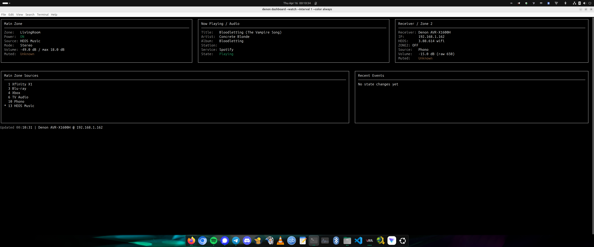

# Denon

A practical controller project for modern Denon AVRs on a home LAN.

## Status

This project is currently in **beta**.

It is tested primarily on a **Denon AVR-X1600H** on Ubuntu. Core AVR control, Zone 2 control, HEOS helper-backed features, and the live dashboard are working, but some behavior may vary by receiver model, firmware version, terminal, and HEOS account state.

## Interfaces

This repo currently ships two control surfaces:

- `denon_release_candidate.sh`: the original Bash/Linux CLI with the widest feature coverage, including discovery, snapshots, HEOS helper-backed workflows, and the live terminal dashboard.
- `powershell/DenonAvrController/`: an experimental native PowerShell module for Windows PowerShell and PowerShell 7+, using PowerShell/.NET HTTP, XML, and TCP APIs directly.

The native PowerShell module does **not** require WSL. Use WSL only if you specifically want to run the Bash CLI from Windows.

The PowerShell module is not yet at full Bash CLI parity. See [powershell/DenonAvrController/README.md](powershell/DenonAvrController/README.md) for current scope and limitations.

## Screenshot



## Development notes

This project was developed with AI assistance and then reviewed, tested, and refined by the maintainer on real Denon AVR hardware.

AI was used to help draft, refactor, and document parts of the code and test flow. Final behavior, validation, and publishing decisions were made by the maintainer.

## What it does

- Discovers a compatible Denon AVR on your LAN
- Reads main-zone and Zone 2 status
- Switches sources by index or friendly name
- Controls power, mute, and volume
- Sends common media and sound mode commands
- Supports local source aliases without changing the AVR itself
- Dumps raw XML endpoints for debugging
- Saves snapshots of core receiver state
- Includes `doctor` checks for dependencies and reachability
- Works when run directly or when sourced into Bash or Zsh

## Run it now

```bash
chmod +x denon_release_candidate.sh denon_automated_test.sh denon_heos_helper.py
./denon_release_candidate.sh doctor
./denon_release_candidate.sh status
```

## Windows PowerShell quick start

PowerShell 7+ on Windows is the primary target for the native module.

From the repository root:

```powershell
Import-Module .\powershell\DenonAvrController\DenonAvrController.psd1
Set-DenonReceiver -IpAddress 192.168.1.100 -SkipCertificateCheck
Get-DenonStatus
Get-DenonSources
```

Replace `192.168.1.100` with your AVR's local IP address. Start with read-only commands first. For state-changing commands, `-SkipCertificateCheck` behavior, and the default `-10.0 dB` max-volume guard, see [powershell/DenonAvrController/README.md](powershell/DenonAvrController/README.md).

## Tested

Tested on Ubuntu against a **Denon AVR-X1600H**.

Validated coverage includes:

* `status`
* `info --json`
* raw reads
* snapshots
* mute / unmute
* volume up / down
* main-zone source switching
* Zone 2 power / source control
* sound mode changes
* media transport commands
* sleep timer and Quick Select commands
* Audyssey / tone controls where the AVR exposes them
* HEOS queue, playback, grouping, browse/search, and play-mode commands
* Bash and Zsh loading / execution

Manual interactive validation was done in Zsh. Shell execution and test harness coverage were also validated from Bash.

## Requirements

Common Linux tools:

* `bash`
* `curl`
* `awk`
* `sed`
* `grep`
* `ip`
* `nc` (netcat)

Optional but useful:

* `jq`
* `shellcheck`
* `python3` for HEOS queue, group, browse/search, and play-mode commands

The HEOS queue/group/browse/search/play-mode features use `denon_heos_helper.py`. Keep that file beside `denon_release_candidate.sh` unless you set `DENON_HEOS_HELPER` to a different path.

Ubuntu install example:

```bash
sudo apt update
sudo apt install -y curl gawk sed grep iproute2 netcat-openbsd jq shellcheck
```

## Install

Clone the repo and make the scripts executable:

```bash
git clone https://github.com/tiffany98101/denon-avr-controller.git
cd denon-avr-controller
chmod +x denon_release_candidate.sh denon_automated_test.sh denon_heos_helper.py
```

### Simplest: run it directly

```bash
./denon_release_candidate.sh status
```

### Recommended: install a wrapper so users can type `denon`

A small Bash wrapper is the cleanest everyday install path because it keeps execution under Bash while still exposing a normal `denon` command.

Example system-wide layout:

```bash
sudo mkdir -p /usr/local/lib/denon
sudo cp -a . /usr/local/lib/denon/
sudo tee /usr/local/bin/denon >/dev/null <<'EOF'
#!/usr/bin/env bash
source /usr/local/lib/denon/denon_release_candidate.sh
denon "$@"
EOF
sudo chmod +x /usr/local/bin/denon
```

Then open a new shell and run:

```bash
denon status
```

### Advanced: source it into your shell

You can also source the script into Bash or Zsh so `denon ...` becomes a shell function. This works, but it is better treated as an advanced option than the default install path.

#### Bash

```bash
echo 'source /full/path/to/denon_release_candidate.sh' >> ~/.bashrc
source ~/.bashrc
```

#### Zsh

```bash
echo 'source /full/path/to/denon_release_candidate.sh' >> ~/.zshrc
source ~/.zshrc
```

## Quick start

Use `./denon_release_candidate.sh ...` if you are running the script directly.

Examples later in this README that use `denon ...` assume you are either using a wrapper install or have sourced the script into your shell.

Check dependencies and receiver reachability:

```bash
./denon_release_candidate.sh doctor
```

Show current status:

```bash
./denon_release_candidate.sh status
./denon_release_candidate.sh info --json
./denon_release_candidate.sh dashboard --ascii
./denon_release_candidate.sh dashboard --watch --interval 5 --color auto
```

In dashboard watch mode, press `q` to quit, `r` to force a redraw, or `Ctrl-C` to exit cleanly.

List sources:

```bash
./denon_release_candidate.sh sources
./denon_release_candidate.sh sources 2
```

Switch source:

```bash
./denon_release_candidate.sh source tv
./denon_release_candidate.sh source heos
```

Adjust volume and mute:

```bash
./denon_release_candidate.sh vol
./denon_release_candidate.sh vol -35
./denon_release_candidate.sh up 1
./denon_release_candidate.sh down 1
./denon_release_candidate.sh mute
./denon_release_candidate.sh unmute
```

Use Zone 2:

```bash
./denon_release_candidate.sh zone2 status
./denon_release_candidate.sh zone2 on
./denon_release_candidate.sh zone2 source 10
./denon_release_candidate.sh zone2 mute
./denon_release_candidate.sh zone2 sleep 60
./denon_release_candidate.sh zone2 off
```

Use sleep, Quick Select, and Audyssey controls:

```bash
./denon_release_candidate.sh sleep
./denon_release_candidate.sh sleep 30
./denon_release_candidate.sh sleep off
./denon_release_candidate.sh qs 1
./denon_release_candidate.sh qs save 1
./denon_release_candidate.sh dyn-eq on
./denon_release_candidate.sh dyn-vol medium
./denon_release_candidate.sh cinema-eq on
./denon_release_candidate.sh multeq reference
./denon_release_candidate.sh bass up
./denon_release_candidate.sh treble down
```

Use HEOS:

```bash
./denon_release_candidate.sh heos now
./denon_release_candidate.sh heos play
./denon_release_candidate.sh heos queue
./denon_release_candidate.sh heos queue play 5
./denon_release_candidate.sh heos groups
./denon_release_candidate.sh heos browse sources
./denon_release_candidate.sh heos repeat all
./denon_release_candidate.sh heos shuffle off
```

Use raw API and snapshots:

```bash
./denon_release_candidate.sh raw get 3
./denon_release_candidate.sh raw get 7
./denon_release_candidate.sh raw set 12 '<MainZone><Mute>1</Mute></MainZone>'
./denon_release_candidate.sh snapshot
```

## Command summary

### Receiver status

```bash
denon info
denon info --json
denon status
denon status --json
denon signal-debug
denon --quiet status
denon --silent status
denon rawstatus
denon raw get <type>
denon raw set <type> '<xml>'
denon snapshot [dir]
denon doctor
denon dashboard [--watch] [--interval seconds] [--ascii|--unicode] [--color auto|always|never]
```

In watch mode, `q` quits, `r` redraws, and `Ctrl-C` exits cleanly.
`--quiet` suppresses normal stdout but still shows stderr. `--silent` suppresses both stdout and stderr.

### Sources

```bash
denon sources
denon sources 2
denon source <id|name>
```

### Local source display names

```bash
denon rename-source <id|name> "<new name>"
denon source-names
denon clear-source-name <id|name>
```

### Power and mute

```bash
denon on
denon off
denon mute
denon unmute
```

### Volume

```bash
denon vol
denon vol -35
denon vol +2
denon up [dB]
denon down [dB]
```

### Quick source shortcuts

```bash
denon xfinity
denon bluray
denon xbox
denon tv
denon phono
denon heos
```

`denon heos` with no arguments still switches the main zone to HEOS Music. `denon heos ...` with arguments uses the HEOS CLI protocol.

### Sleep and Quick Select

```bash
denon sleep
denon sleep 30
denon sleep off
denon qs 1
denon qs save 1
```

### Presets

```bash
denon movie
denon game
denon night
denon music
```

### Sound mode and media

```bash
denon mode <mode>
denon dyn-eq <on|off>
denon dyn-vol <off|light|medium|heavy>
denon cinema-eq <on|off>
denon multeq <reference|bypass-lr|flat|manual|off>
denon bass <up|down|value>
denon treble <up|down|value>
denon play
denon pause
denon stop
denon next
denon prev
denon track
denon now
```

### HEOS

```bash
denon heos now
denon heos play
denon heos pause
denon heos stop
denon heos next
denon heos prev
denon heos queue
denon heos queue play 5
denon heos queue remove 3
denon heos queue move 7 2
denon heos queue clear
denon heos queue save "Road Trip"
denon heos groups
denon heos group info
denon heos group set 123,456
denon heos group volume 35
denon heos group mute on
denon heos browse sources
denon heos browse <sid|source-name> [cid]
denon heos search <sid|source-name> "depeche mode" [criteria]
denon heos play-stream <sid> <cid> <mid> [name]
denon heos repeat <off|all|one>
denon heos shuffle <on|off>
denon heos update
```

HEOS queue item arguments are resolved as visible 1-based queue positions when the queue can be read; otherwise they are sent as HEOS queue IDs.

### Zone 2

```bash
denon zone2 status
denon zone2 sources
denon zone2 source <id|name>
denon zone2 rename-source <id|name> "<new name>"
denon zone2 clear-source-name <id|name>
denon zone2 on
denon zone2 off
denon zone2 mute
denon zone2 unmute
denon zone2 vol <raw>
denon zone2 volume <raw>
denon zone2 sleep
denon zone2 sleep 90
denon zone2 sleep off
```

### Discovery and setup

```bash
denon discover
denon setip <ip>
```

## Automated test script

The repo includes `denon_automated_test.sh` for repeatable checks.

Run the safe pass:

```bash
./denon_automated_test.sh --script ./denon_release_candidate.sh
```

Run the destructive/state-changing pass only when nobody is using the receiver:

```bash
./denon_automated_test.sh --script ./denon_release_candidate.sh --destructive
```

Suggested manual checks before public release:

* `bash -n denon_release_candidate.sh`
* `shellcheck -s bash denon_release_candidate.sh`
* `bash ./denon_release_candidate.sh --help`
* `zsh -lc 'source ./denon_release_candidate.sh; whence denon; denon status'`

## Environment variables

These are supported by the script:

```bash
DENON_IP
DENON_DEFAULT_IP
DENON_SCAN_LAN=1
DENON_MAX_VOLUME_DB
DENON_VOLUME_STEP_DB
DENON_SOURCE_ALIASES
DENON_CURL_CONNECT_TIMEOUT
DENON_CURL_MAX_TIME
DENON_SSDP_TIMEOUT
DENON_SSDP_MX
DENON_HEOS_PID
DENON_HEOS_GID
DENON_HEOS_HELPER
DENON_HEOS_TIMEOUT
DENON_DEBUG=1
NO_COLOR
```

Examples:

Pin the receiver IP:

```bash
export DENON_IP=192.168.1.162
```

Enable verbose logging:

```bash
export DENON_DEBUG=1
```

Increase request timeout if source changes are slow:

```bash
export DENON_CURL_MAX_TIME=10
```

## Source aliases

Aliases are local only. They do **not** rename sources inside the AVR.

Example:

```bash
denon rename-source tv "Living Room TV"
denon sources
denon source "Living Room TV"
denon clear-source-name "Living Room TV"
```

## Safety notes

This script is intended for use on a **trusted local network**.

It talks to the receiver over local control endpoints and may use HTTPS with self-signed or device-local certificate behavior typical of consumer AV equipment. Do not treat it like a hardened remote-management tool for hostile networks.

Before running state-changing commands:

* Be careful with volume commands
* Be careful with Zone 2 power and source changes
* Be careful with raw `set` commands
* Volume commands use the AVR's dB-style control model internally. Test with small adjustments first, especially if your receiver UI is configured to show a different volume scale.
* Do not run destructive or disruptive tests while someone is using the receiver

## Troubleshooting

Run the built-in checks first:

```bash
denon doctor
```

If discovery is noisy or unreliable, test with an explicit one-shot IP first:

```bash
DENON_IP=192.168.1.162 denon status
```

If you later decide to pin the IP longer-term, you can export `DENON_IP`, but using it one-shot first makes discovery problems easier to notice and debug.

If source switching or writes time out on a slow response, try:

```bash
export DENON_CURL_MAX_TIME=10
```

If you want to see request/debug flow:

```bash
DENON_DEBUG=1 denon status
```

Basic shell checks:

```bash
bash -n denon_release_candidate.sh
python3 -m py_compile denon_heos_helper.py
shellcheck -s bash denon_release_candidate.sh
```

## Implementation notes

Most AVR features are implemented directly in `denon_release_candidate.sh` using the Denon AVR control protocol over the existing telnet helper. HEOS queue, group, browse/search, stream, repeat, and shuffle commands use `denon_heos_helper.py` because those commands require socket I/O plus structured JSON array parsing and URL encoding. The public command surface remains the existing `denon` command.

The dashboard renderer keeps the existing cards and data collection path. It recomputes terminal width on every render, uses stacked / compact / ultrawide layouts based on the current width, and redraws on `SIGWINCH` in watch mode. Color is optional and semantic only: `--color auto` uses color only on capable terminals, `--color always` forces color unless `NO_COLOR` is set, and `--color never` disables ANSI output.

`denon signal-debug` is intentionally diagnostic. Local testing on the AVR-X1600H showed `OPINFINS` / `OPINFASP` vary by selected input family, but did not prove a safe mapping for connected devices or live signal on every configured source. The normal dashboard therefore does not display a connected-input indicator.

## Bash and Zsh notes

This is a **Bash-oriented** script that can also be sourced and used comfortably from Zsh.

It is **not** a POSIX `sh` script.

## Known limits

* Tested on Ubuntu with a Denon AVR-X1600H
* Intended for trusted local-network use
* Bash-oriented; usable from Zsh when sourced
* Not a POSIX `sh` script
* Behavior may vary across receiver models and firmware versions
* `signal-debug` is diagnostic only; no proven connected-input indicator is exposed yet

## Example session

```bash
denon doctor
denon status
denon sources
denon source heos
denon status
denon vol -35
denon mute
denon unmute
denon zone2 status
denon snapshot
```

## Why this exists

Denon receivers expose useful LAN control interfaces, but the raw API is awkward to use by hand. This script is meant to be a practical operator tool for real home-network use, testing, debugging, and light reverse-engineering.

## Disclaimer

This project is an independent tool and is not affiliated with, authorized by, or endorsed by Denon or Masimo Consumer. Use it at your own risk.

## License

MIT
